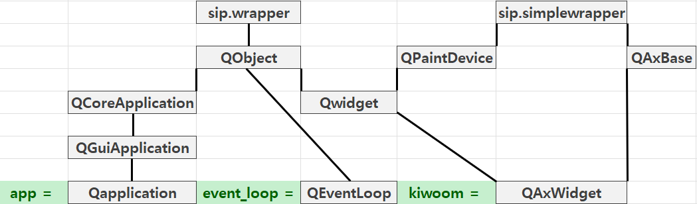

# Surfing : Automated Stock Trading System
<h2> # Algorithm Trading & System Trading </h2>

키움증권 API를 사용하여 코스피, 코스닥에서 거래되는 종목을 특정 거래 조건에 맞춰 매매하는 시스템

## # Base Class Architecture

- QApplication : 프로그램을 앱처럼 실행하거나 홈페이지처럼 실행할 수 있도록 그래픽적인 요소를 제어할 수 있는 기능을 포함
- QAxContainer : 마이크로소프트사에서 제공하는 프로세스를 가지고 화면을 구성하는 데 필요한 기능들이 담겨있음
- QAxWidget : 디자인 구성을 컨트롤하고 재사용하는 기능들을 포함
- QAxBase.setControl() : 설치된 API 모듈을 파이썬에서 쓸 수 있도록 함. 즉, .ocx 확장자도 파이썬에서 사용할 수 있게 함
- QAxBase.dynamicCall()
- OCX : OLE Custom eXtension의 약자. 마이크로소프트 윈도우 운영체제에서 실행할 수 있도록 만들어진 특수한 목적의 프로그램이며 확장자명이 ocx임.


## # Kiwoom OpenAPI Method
- 시그널(Signal) : 키움 서버에 요청하는 신호
- 슬롯(Slot) : 요청한 데이터의 결과값을 받을 공간
- 이벤트(Event) : 시그널이 발생하면 결과값을 어느 슬롯에서 받을 것인지 연결해주는 다리  

### 1. 키움 API를 파이썬에서 사용
"키움 API 레지스트리 제어 함수"

```python
self.kiwoom = QAxWidget("KHOPENAPI.KHOpenAPICtrl.1")  
# 또는
kiwoom = self.setControl("KHOPENAPI.KHOpenAPICtrl.1")
```

### 2. QAxBase 클래스의 dynamicCall Method를 사용하는 함수

#### CommConnect()
"로그인 윈도우 실행"

```python
self.kiwoom.dynamicCall("CommConnect()")
```

#### GetConnectState()
"현재 접속상태 반환"

```python
self.kiwoom.dynamicCall("GetConnectState()")
```

#### SetInputValue(1, 2)
"Transaction 입력 값을 서버통신 전에 입력"

```python
self.kiwoom.dynamicCall("SetInputValue(QString, QString)", "종목코드", '039490')
```

#### GetLoginInfo(1)
"로그인 후 사용할 수 있으며 인자값에 대응하는 정보를 얻을 수 있음"

    참고! 인자에 들어갈 수 있는 값은 아래와 같음
    * "ACCOUNT_CNT" : 전체 계좌 개수를 반환
    * "ACCNO" : 전체 계좌를 반환. 계좌별 구분은 ';'
    * "USER_ID" : 사용자 ID 반환
    * "USER_NAME" : 사용자명 반환
    * "KEY_BSECGB" : 키보드보안 해지여부. 0: 정상, 1: 해지
    * "FIREW_SECGB" : 방화벽 설정 여부. 0: 미설정, 1: 설정, 2: 해지
    * "GetServerGubun" : 접속서버 구분을 반환. 1: 모의투자, 나머지: 실서버

```python
account_num = self.kiwoom.dynamicCall("GetLoginInfo(QString)", ["ACCNO"]).rstrip(';')
```

#### GetCodeListByMarket(1)
"시장구분에 따른 종목코드를 반환"

    참고! 인자에 들어갈 수 있는 값은 아래와 같음
    * "0" : 장내
    * "3" : ELW
    * "4" : Mutual Fund
    * "5" : 신주인수권
    * "6" : 리츠
    * "8" : ETF
    * "9" : High Yield Fund 
    * "10" : KOSDAQ
    * "30" : 제3시장

```python
kospi_code_list = self.kiwoom.dynamicCall("GetCodeListByMarket(QString)", ["0"]).split(';')
```

#### GetMasterCodeName(1)
"종목코드의 한글명을 반환"

```python
item_name = self.kiwoom.dynamicCall("GetMasterCodeName(QString)", ["005680"])
```

#### DisconnectRealData(1)
"스크린 번호 끊기"

    참고! 인자는 아래와 같음
    * screen_num : 스크린 번호

```python
def stop_screen_cancel(self, sScrNo=None):
    self.dynamicCall('DisconnectRealData(QString)', sScrNo)
```

#### SetRealRemove(1, 2)
"특정 스크린 번호 안에 있는 종목 하나 취소"

    참고! 인자는 아래와 같음
    * screen_num : 스크린 번호
    * code : 종목코드

#### CommRqData(1, 2, 3, 4)
"TR을 서버로 전송"

    참고! 여기서는 opt10001이라는 트랜젝션을 사용
    opt10001: 주식기본정보요청
    1. OpenAPI 조회 함수 입력값을 설정
        종목코드 = 전문 조회할 종목코드
        SetInputValue("종목코드", "입력값 1");
    2. OpenAPI 조회 함수를 호출해서 전문을 서버로 전송
        CommRqData("RQName", "opt10001", "0", "화면번호")

```python
self.kiwoom.dynamicCall("CommRqData(QString, QString, int, QString)", "opt10001_req", "opt10001", 0, "0101")
```

#### GetCommData(1, 2, 3, 4, 5)
"TR 데이터, 실시간 데이터, 체결잔고 데이터를 반환"

    참고! 파라미터는 다음과 같다.
    TR Data     : 1. TR명,      2. 사용안함,    3. 레코드명,    4. 반복인덱스,  5. 아이템명
    실시간 Data : 1. Key Code,  2. Real Type,   3. Item Index,  4. 사용안함     5. 사용안함
    체결 Data   : 1. 체결구분,  2. "-1",        3. 사용안함,    4. Item Index,  5. 사용안함

```python
item_name = self.kiwoom.dynamicCall("GetCommData(QString, QString, QString, int, QString)", trcode, "", rqname, 0, "종목명")
```

#### SetRealReg(1, 2, 3, 4)
"실시간 데이터 등록하는 함수"

    참고! 인자는 아래와 같음
    * screen_num : 스크린 번호
    * code : 종목 번호
    * fids : FID
    * 등록타입 : "0"은 새로운 실시간 요청을 할 때 사용, "1"은 실시간으로 받고 싶은 정보를 추가할 때 사용. 실시간 정보를 요청할 때 종목을 "0"으로 등록하면 이전에 등록된 실시간 연결은 모두 초기화되고 새롭게 등록됨. 

```python
self.dynamicCall("SetRealReg(QString, QString, QString, QString)",
                self.screen_start_stop_real, # 스크린 번호
                '', # 원래는 종목코드가 들어가지만 주식 장의 시간 상태를 실시간으로 받겠다는 뜻
                self.realType.REALTYPE['장시작시간']['장운영구분'], # FID
                '0')

def real_event_slot(self):
    self.OnReceiveRealData.connect(self.realdata_slot)

def realdata_slot(self, sCode, sRealType, sRealData):
    if sRealType == "장시작시간":
        fid = self.realType.REALTYPE[sRealType]['장운영구분'] # (0:장시작전, 2:장종료전(20분), 3:장시작, 4,8:장종료(30분), 9:장마감)
        value = self.dynamicCall("GetCommRealData(QString, int)", sCode, fid)

        if value == '0':
            print("장 시작 전")

        elif value == '3':
            print("장 시작")

        elif value == "2":
            print("장 종료, 동시호가로 넘어감")

        elif value == "4":
            print("3시30분 장 종료")
```

#### GetCommRealData(1, 2)
"실시간 데이터를 가져오는 함수"

    참고! 인자는 아래와 같음
    * code : 종목코드
    * fid : FID

```python

for code in self.portfolio_stock_dict.keys():
            screen_num = self.portfolio_stock_dict[code]['스크린번호']
            fids = self.realType.REALTYPE['주식체결']['체결시간']
            self.dynamicCall("SetRealReg(QString, QString, QString, QString)", 
                            screen_num, # 스크린 번호
                            code, # 종목 코드
                            fids, # FID 
                            "1" #등록타입)

self.kiwoom.OnReceiveRealData.connect(self.realdata_slot)

def realdata_slot(self, sCode, sRealType, sRealData):
    if sRealType == "주식체결":
        a = self.dynamicCall("GetCommRealData(QString, int)", sCode, self.realType.REALTYPE[sRealType]['체결시간']) # 출력 HHMMSS
        b = self.dynamicCall("GetCommRealData(QString, int)", sCode, self.realType.REALTYPE[sRealType]['현재가']) # 출력 : +(-)2520
        c = self.dynamicCall("GetCommRealData(QString, int)", sCode, self.realType.REALTYPE[sRealType]['전일대비']) # 출력 : +(-)2520
        d = self.dynamicCall("GetCommRealData(QString, int)", sCode, self.realType.REALTYPE[sRealType]['등락율']) # 출력 : +(-)12.98
        e = self.dynamicCall("GetCommRealData(QString, int)", sCode, self.realType.REALTYPE[sRealType]['(최우선)매도호가']) # 출력 : +(-)2520
        f = self.dynamicCall("GetCommRealData(QString, int)", sCode, self.realType.REALTYPE[sRealType]['(최우선)매수호가']) # 출력 : +(-)2515
        g = self.dynamicCall("GetCommRealData(QString, int)", sCode, self.realType.REALTYPE[sRealType]['거래량']) # 출력 : +240124 매수일때, -2034 매도일 때
        h = self.dynamicCall("GetCommRealData(QString, int)", sCode, self.realType.REALTYPE[sRealType]['누적거래량']) # 출력 : 240124
        i = self.dynamicCall("GetCommRealData(QString, int)", sCode, self.realType.REALTYPE[sRealType]['고가']) # 출력 : +(-)2530
        j = self.dynamicCall("GetCommRealData(QString, int)", sCode, self.realType.REALTYPE[sRealType]['시가']) # 출력 : +(-)2530
        k = self.dynamicCall("GetCommRealData(QString, int)", sCode, self.realType.REALTYPE[sRealType]['저가']) # 출력 : +(-)2530
```

#### SendOrder(1, 2, 3, 4, 5, 6, 7, 8, 9)
"매수, 매도 하는 함수"

    참고! 인자에 들어갈 수 있는 값은 아래와 같음
    * sRQName : 주문요청시 요청을 구분짓기 위한 요청 이름. TR의 요청 이름과 같은 역할
    * sScreenNo : 스크린 번호
    * sAccNo : 계좌번호
    * nOrderType : 주문유형. 1은 신규매수이며 일반적인 매수. 2는 신규매도이며 일반적인 매도. 3은 매수취소, 4는 매도취소, 5는 매수주문 넣었던 종목이 체결되지 않아 다른 가격대로 다시 넣는 정정주문. 6도 마찬가지
    * sCode : 주문넣는 종목코드
    * nQty : 매매할 수량
    * nPrice : 주문 넣을 가격
    * sHogaGb : 00은 지정가, 03은 시장가. 만약 시장가로 주문을 넣으려면 nPrice는 빈값
    * sOrgOrderNo : 주문이 들어가면 해당 주문에 대해 고유한 주문번호가 부여됨. 신규주문을 요청할 때는 주문번호가 없기 때문에 빈값. 이후에 주문취소 및 정정주문에서는 주문번호 필요. 

```python
self.dynamicCall("SendOrder(QString, QString, QString, int, QString, int, int, QString, QString)",
                "신규매수",
                self.portfolio_stock_dict[sCode]['주문용스크린번호'],
                self.account_num,
                1, # 매수는 1
                sScode, # 매수할 종목코드
                quantity, # 매수수량
                e, # 매수가격. 지정가이기 때문에 0이 아님
                self.realType.SENDTYPE['거래구분']['지정가'], # 호가구분. 00은 지정가, 03은 시장가
                '' # 주문번호. 신규매수는 주문번호가 없음)

self.dynamicCall("SendOrder(QString, QString, QString, int, QString, int, int, QString, QString)",
                "매수취소",
                self.portfolio_stock_dict[sCode]['주문용스크린번호'],
                self.account_num,
                3, # 매수취소는 3
                sScode, # 매수할 종목코드
                0, # 매수취소수량. 0은 미체결수량 전부를 매수취소한다는 뜻. 
                0, # 매수취소라서 주문가격은 필요없으므로 0
                self.realType.SENDTYPE['거래구분']['지정가'], # 호가구분. 00은 지정가, 03은 시장가
                order_num # 주문번호)

self.dynamicCall("SendOrder(QString, QString, QString, int, QString, int, int, QString, QString)",
                "신규매도",
                self.portfolio_stock_dict[sCode]['주문용스크린번호'],
                self.account_num,
                2, # 매도는 2
                sScode, # 매도할 종목코드
                jd['주문가능수량'], # 매도수량
                0, # 매도가격. 시장가이기 때문에 0
                self.realType.SENDTYPE['거래구분']['시장가'],
                '' # 주문번호. 신규매도는 주문번호가 없음)
```

#### GetChejanData(1)
"체결 데이터를 갖고 온다"

    참고! 인자는 다음과 같다
    # fid : FID 번호

```python
self.dynamicCall("SendOrder(QString, QString, QString, int, QString, int, int, QString, QString)",
                "신규매도",
                self.portfolio_stock_dict[sCode]['주문용스크린번호'],
                self.account_num,
                2, # 매도는 2
                sScode, # 매도할 종목코드
                jd['주문가능수량'], # 매도수량
                0, # 매도가격. 시장가이기 때문에 0
                self.realType.SENDTYPE['거래구분']['시장가'],
                '' # 주문번호. 신규매도는 주문번호가 없음)

self.OnReceiveChejanData.connect(self.chejan_slot)

def chejan_slot(self, sGubun, nItemCnt, sFidList):
    if int(sGubun) == 0: #주문체결
        account_num = self.dynamicCall("GetChejanData(int)", self.realType.REALTYPE['주문체결']['계좌번호'])
        sCode = self.dynamicCall("GetChejanData(int)", self.realType.REALTYPE['주문체결']['종목코드'])[1:]
        stock_name = self.dynamicCall("GetChejanData(int)", self.realType.REALTYPE['주문체결']['종목명'])
        origin_order_number = self.dynamicCall("GetChejanData(int)", self.realType.REALTYPE['주문체결']['원주문번호']) # 출력 : defaluse : "000000"
        order_number = self.dynamicCall("GetChejanData(int)", self.realType.REALTYPE['주문체결']['주문번호']) # 출럭: 0115061 마지막 주문번호
        order_status = self.dynamicCall("GetChejanData(int)", self.realType.REALTYPE['주문체결']['주문상태']) # 출력: 접수, 확인, 체결
        order_quan = self.dynamicCall("GetChejanData(int)", self.realType.REALTYPE['주문체결']['주문수량']) # 출력 : 3
        order_price = self.dynamicCall("GetChejanData(int)", self.realType.REALTYPE['주문체결']['주문가격']) # 출력: 21000
        not_chegual_quan = self.dynamicCall("GetChejanData(int)", self.realType.REALTYPE['주문체결']['미체결수량']) # 출력: 15, default: 0
        order_gubun = self.dynamicCall("GetChejanData(int)", self.realType.REALTYPE['주문체결']['주문구분']) # 출력: -매도, +매수
        chegual_time_str = self.dynamicCall("GetChejanData(int)", self.realType.REALTYPE['주문체결']['주문/체결시간']) # 출력: '151028'
        chegual_price = self.dynamicCall("GetChejanData(int)", self.realType.REALTYPE['주문체결']['체결가']) # 출력: 2110 default : ''

        if chegual_price == '':
            chegual_price = 0
        else:
            chegual_price = int(chegual_price)

        chegual_quantity = self.dynamicCall("GetChejanData(int)", self.realType.REALTYPE['주문체결']['체결량']) # 출력: 5 default : ''
        if chegual_quantity == '':
            chegual_quantity = 0
        else:
            chegual_quantity = int(chegual_quantity)

        current_price = self.dynamicCall("GetChejanData(int)", self.realType.REALTYPE['주문체결']['현재가']) # 출력: -6000
        first_sell_price = self.dynamicCall("GetChejanData(int)", self.realType.REALTYPE['주문체결']['(최우선)매도호가']) # 출력: -6010
        first_buy_price = self.dynamicCall("GetChejanData(int)", self.realType.REALTYPE['주문체결']['(최우선)매수호가']) # 출력: -6000

```

### 3. Event 처리 함수

#### OnEventConnect
"로그인 이벤트 처리"

```python
self.kiwoom.OnEventConnect.connect(self.event_connect)

def event_connect(self, err_code):
    if err_code == 0: self.text_edit.append("로그인 성공")
```

#### OnReceiveTrData
"트랜잭션 데이터를 받음"

    참고! 인자는 아래와 같음
    * screen_no : 화면번호
    * rqname : 사용자구분 명, CommRqData의 rqname과 매핑되는 이름
    * trcode : transaction 명, CommRqData의 trcode와 매핑되는 이름
    * recordname : record 명
    * prev_next : 연속조회 유무
    * data_len : 사용안함
    * err_code : 사용안함
    * msg1 : 사용안함
    * msg2 : 사용안함

```python
self.dynamicCall("SetInputValue(변수명들)", 변수데이터들)
self.dynamicCall("CommRqData(변수명들)", 변수데이터들)

self.kiwoom.OnReceiveTrData.connect(self.receive_trdata)

def receive_trdata(self, screen_no, rqname, trcode, recordname, prev_next, data_len, err_code, msg1, msg2):
    if rqname == 'opt10001_req':
        pass
```

#### OnReceiveRealData
"실시간 데이터를 받음"

```python
self.dynamicCall('SetRealReg(변수명들)', 변수데이터들)

self.kiwoom.OnReceiveRealData.connect(self.realdata_slot)

def realdata_slot(self, sCode, sRealType, sRealData):
    if sRealType == "장시작시간":
        pass
```

#### OnReceiveChejanData
"실시간 체결정보를 받음"

```python
self.dynamicCall('SendOrder(변수명들)', 변수데이터들)

self.kiwoom.OnReceiveChejanData.connect(self.chejan_slot)

def chejan_slot(self, sGubun, nItemCnt, sFidList):
    if int(sGubun) == 0: # 주문체결
        pass
    elif int(sGubun) == 1: # 잔고
        pass
```

#### OnReceiveMsg
"실시간 메시지를 받음"

```python
self.OnReceiveMsg.connect(self.msg_slot)

def msg_slot(self, sScrNo, sRQName, sTrCode, msg):
    print("스크린: %s, 요청이름: %s, tr코드: %s --- %s" %(sScrNo, sRQName, sTrCode, msg))
```

### 4. 트랜잭션

#### 예수금 정보 가져오기 => opw00001
```python
self.screen_my_info = "2000"

def detail_account_info(self, sPrevNext="0"):
    self.dynamicCall("SetInputValue(QString, QString)", "계좌번호", self.account_num)
    self.dynamicCall("SetInputValue(QString, QString)", "비밀번호", "0000")
    self.dynamicCall("SetInputValue(QString, QString)", "비밀번호입력매체구분", "00")
    self.dynamicCall("SetInputValue(QString, QString)", "조회구분", "1")
    self.dynamicCall("CommRqData(QString, QString, int, QString)", "예수금상세현황요청", "opw00001", sPrevNext, self.screen_my_info)

self.OnReceiveTrData.connect(self.trdata_slot)

def trdata_slot(self, sScrNo, sRQName, sTrCode, sRecordName, sPrevNext):
    if sRQName == '예수금상세현황요청':
        deposit = self.dynamicCall('GetCommData(QString, QString, int, QString)', sTrCode, sRQName, 0, '예수금')
        output_deposit = self.dynamicCall('GetCommData(QString, QString, int, QString)', sTrCode, sRQName, 0, '출금가능금액')
        self.stop_screen_cancel(self.screen_my_info)

def stop_screen_cancel(self, sScrNo=None):
    self.dynamicCall('DisconnectRealData(QString)', sScrNo)
```

#### 계좌평가잔고내역 정보 가져오기 => opw00018
```python
self.screen_my_info = "2000"

def detail_account_mystock(self, sPrevNext="0"):
    self.dynamicCall("SetInputValue(QString, QString)", "계좌번호", self.account_num)
    self.dynamicCall("SetInputValue(QString, QString)", "비밀번호", "0000")
    self.dynamicCall("SetInputValue(QString, QString)", "비밀번호입력매체구분", "00")
    self.dynamicCall("SetInputValue(QString, QString)", "조회구분", "1")
    self.dynamicCall("CommRqData(QString, QString, int, QString)", "계좌평가잔고내역요청", "opw00018", sPrevNext, self.screen_my_info)

self.OnReceiveTrData.connect(self.trdata_slot)
self.account_stock_dict = {}

def trdata_slot(self, sScrNo, sRQName, sTrCode, sRecordName, sPrevNext):
    if sRQName == "계좌평가잔고내역요청":
        total_buy_money = self.dynamicCall("GetCommData(QString, QString, int, QString)", sTrCode, sRQName, 0, "총매입금액") # 출력 : 000000000746100
        total_profit_loss_money = self.dynamicCall("GetCommData(QString, QString, int, QString)", sTrCode, sRQName, 0, "총평가손익금액") # 출력 : 000000000009761
        total_profit_loss_rate = self.dynamicCall("GetCommData(QString, QString, int, QString)", sTrCode, sRQName, 0, "총수익률(%)") # 출력 : 000000001.31


        rows = self.dynamicCall("GetRepeatCnt(QString, QString)", sTrCode, sRQName) # 최대 20종목

        for i in range(rows):
            code = self.dynamicCall("GetCommData(QString, QString, int, QString)", sTrCode, sRQName, i, "종목번호")
            code = code.strip()[1:]

            code_nm = self.dynamicCall("GetCommData(QString, QString, int, QString)", sTrCode, sRQName, i, "종목명")
            stock_quantity = self.dynamicCall("GetCommData(QString, QString, int, QString)", sTrCode, sRQName, i, "보유수량")
            buy_price = self.dynamicCall("GetCommData(QString, QString, int, QString)", sTrCode, sRQName, i, "매입가")
            learn_rate = self.dynamicCall("GetCommData(QString, QString, int, QString)", sTrCode, sRQName, i, "수익률(%)")
            current_price = self.dynamicCall("GetCommData(QString, QString, int, QString)", sTrCode, sRQName, i, "현재가")
            total_chegual_price = self.dynamicCall("GetCommData(QString, QString, int, QString)", sTrCode, sRQName, i, "매입금액")
            possible_quantity = self.dynamicCall("GetCommData(QString, QString, int, QString)", sTrCode, sRQName, i, "매매가능수량")


            if code in self.account_stock_dict:
                pass
            else:
                self.account_stock_dict[code] = {}

            code_nm = code_nm.strip()
            stock_quantity = int(stock_quantity.strip())
            buy_price = int(buy_price.strip())
            learn_rate = float(learn_rate.strip())
            current_price = int(current_price.strip())
            total_chegual_price = int(total_chegual_price.strip())
            possible_quantity = int(possible_quantity.strip())

            self.account_stock_dict[code].update({"종목명": code_nm})
            self.account_stock_dict[code].update({"보유수량": stock_quantity})
            self.account_stock_dict[code].update({"매입가": buy_price})
            self.account_stock_dict[code].update({"수익률(%)": learn_rate})
            self.account_stock_dict[code].update({"현재가": current_price})
            self.account_stock_dict[code].update({"매입금액": total_chegual_price})
            self.account_stock_dict[code].update({"매매가능수량": possible_quantity})

        if sPrevNext == "2":
            self.detail_account_mystock(sPrevNext="2")
        else:
            self.detail_account_info_event_loop.exit()
```

#### 미체결종목 가져오기 => opt10075
```python
self.not_account_stock_dict = {}

def not_concluded_account(self, sPrevNext="0"):
    print("미체결 종목 요청")
    self.dynamicCall("SetInputValue(QString, QString)", "계좌번호", self.account_num)
    self.dynamicCall("SetInputValue(QString, QString)", "체결구분", "1")
    self.dynamicCall("SetInputValue(QString, QString)", "매매구분", "0")
    self.dynamicCall("CommRqData(QString, QString, int, QString)", "실시간미체결요청", "opt10075", sPrevNext, self.screen_my_info)

    self.detail_account_info_event_loop.exec_()

self.OnReceiveTrData.connect(self.trdata_slot)

def trdata_slot(self, sScrNo, sRQName, sTrCode, sRecordName, sPrevNext):
    if sRQName == "실시간미체결요청":
        rows = self.dynamicCall("GetRepeatCnt(QString, QString)", sTrCode, sRQName)

        for i in range(rows):
            code = self.dynamicCall("GetCommData(QString, QString, int, QString)", sTrCode, sRQName, i, "종목코드")

            code_nm = self.dynamicCall("GetCommData(QString, QString, int, QString)", sTrCode, sRQName, i, "종목명")
            order_no = self.dynamicCall("GetCommData(QString, QString, int, QString)", sTrCode, sRQName, i, "주문번호")
            order_status = self.dynamicCall("GetCommData(QString, QString, int, QString)", sTrCode, sRQName, i, "주문상태") # 접수,확인,체결
            order_quantity = self.dynamicCall("GetCommData(QString, QString, int, QString)", sTrCode, sRQName, i, "주문수량")
            order_price = self.dynamicCall("GetCommData(QString, QString, int, QString)", sTrCode, sRQName, i, "주문가격")
            order_gubun = self.dynamicCall("GetCommData(QString, QString, int, QString)", sTrCode, sRQName, i, "주문구분") # -매도, +매수, -매도정정, +매수정정
            not_quantity = self.dynamicCall("GetCommData(QString, QString, int, QString)", sTrCode, sRQName, i, "미체결수량")
            ok_quantity = self.dynamicCall("GetCommData(QString, QString, int, QString)", sTrCode, sRQName, i, "체결량")

            code = code.strip()
            code_nm = code_nm.strip()
            order_no = int(order_no.strip())
            order_status = order_status.strip()
            order_quantity = int(order_quantity.strip())
            order_price = int(order_price.strip())
            order_gubun = order_gubun.strip().lstrip('+').lstrip('-')
            not_quantity = int(not_quantity.strip())
            ok_quantity = int(ok_quantity.strip())

            if order_no in self.not_account_stock_dict:
                pass
            else:
                self.not_account_stock_dict[order_no] = {}

            self.not_account_stock_dict[order_no].update({'종목코드': code})
            self.not_account_stock_dict[order_no].update({'종목명': code_nm})
            self.not_account_stock_dict[order_no].update({'주문번호': order_no})
            self.not_account_stock_dict[order_no].update({'주문상태': order_status})
            self.not_account_stock_dict[order_no].update({'주문수량': order_quantity})
            self.not_account_stock_dict[order_no].update({'주문가격': order_price})
            self.not_account_stock_dict[order_no].update({'주문구분': order_gubun})
            self.not_account_stock_dict[order_no].update({'미체결수량': not_quantity})
            self.not_account_stock_dict[order_no].update({'체결량': ok_quantity})


        self.detail_account_info_event_loop.exit()
```
